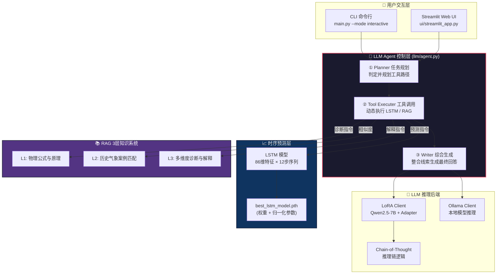
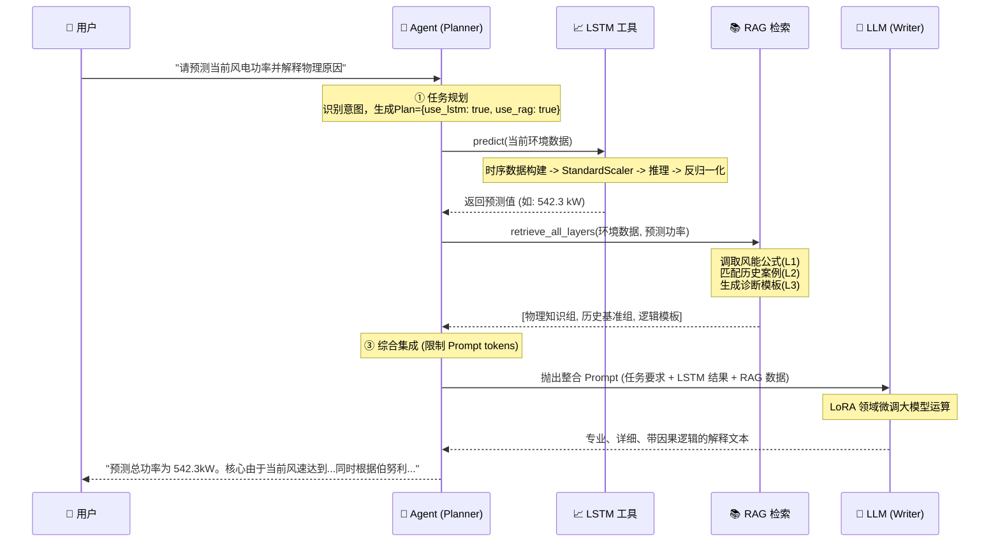

# 🌪️ 风电智能预测解释系统 (Intelligent Wind Power Prediction & Explanation System)

> **基于物理知识增强的时间序列预测解释型 LLM Agent 系统**

本项目融合了 **深度学习时序预测 (LSTM)**、**检索增强生成 (RAG)** 以及 **大型语言模型智能体 (LLM Agent)**。系统不仅能够对风电功率进行高精度的数值预测，还能像人类风电专家一样，结合气象学和空气动力学物理知识，深度解释“为什么会这样预测”、“异常原因是什么”，实现了从“黑盒预测”到“白盒可解释认知”的跨越。

---

## 🌟 核心创新与特性

1. **🤖 真正的 Agent 智能调度层**
   - **Planner-Executor-Writer 架构**：LLM 不仅只作为聊天工具，而是作为系统“大脑”。能够解析用户自然语言查询，动态决定是否调用「LSTM 预测工具」或「RAG 检索工具」。
   - **CoT (Chain-of-Thought) 推理**：内建 4 步推理链（气象分析→物理机制→历史对比→得出结论），保证解释的严谨性。

2. **📈 86维增强特征时序预测**
   - 构建了 8 级深度的特征工程体系（包含基础、时间、风向、滞后、滚动窗口、差分、交互、季节特征），从 4 个原始气象维扩展到 **86 维隐式特征**。
   - **双尺度规范化**：严格的 StandardScaler 处理，保障模型推理时的极高稳定性。

3. **📚 三层递进式 RAG 知识检索**
   - **Layer 1 (物理知识)**：检索底层空气动力学公式、密度/温度效应原理。
   - **Layer 2 (历史案例)**：基于欧氏距离，寻找历史上极度相似的天气特征及其实际风电输出表现。
   - **Layer 3 (预测解释)**：根据检索内容与当前预测结果动态融合，生成物理引导的解释。

4. **🔧 LoRA 高效领域微调**
   - 支持在商业级开源基座模型 (如 Qwen2.5-7B) 上进行 QLoRA 指令微调。
   - 自动生成 100+ 条针对“数值解释”、“异常诊断”、“因果发现”的机器生成指令集。

---

## 🗺️ 系统总览与架构设计

### 1. 总体架构图

系统呈现高度模块化分层，由用户层、Agent 大脑、工具层和数据层共同组成。



### 2. Agent 智能体运行时序流
LLM 如何规划、调度和解释预测结果：



---

## 🛣️ 详细技术路线图 (6阶段落地)

整个系统由 6 个工程步骤紧密结合完成：

### 🔹 STEP 1：极度硬核的数据工程 (`enhanced_feature_engineering.py`)
我们将枯燥的 4 个气象维度极大地延展为高价值的信息：
- **流向**：基础输入 -> 分解时间/周期 -> 加入滞后期 (lag) -> 提取窗口统计 (mean/std) -> 生成导数/差分 -> 结合物理非线性公式 (如理论风能 $v^3$) -> 输出 **86维特征矩阵 (`data_feature_enhanced.csv`)**。

### 🔹 STEP 2：垂类知识体系构建 (`knowledge/` & `rag/`)
- 收集包含：【风能物理计算】、【气象动力学影响】、【宏观季节规律】、【机器学习算法认知】 4大模块。
- **技术实现**：通过 `knowledge_base_manager.py` 切分语义段落 (Chunks)，并利用 `bge-small-zh-v1.5` 通过 `FAISS` 固化为极速向量检索数据库。

### 🔹 STEP 3：数值基模型训练 (`train_lstm.py`)
- **时间窗口**：过去 12 步 (即过去 1 小时) 的 86 维特征。
- **架构**：LSTM 隐藏层(64维) × 2层 + Dropout(0.2) + Fully Connected Output。
- **持久化**：训练后不仅保存权重，**还硬编码封存 X (特征) 和 y (目标) 的标准差/均值** 供后续预测接口进行无缝的反标准化闭环。

### 🔹 STEP 4：LLM 行业微调注入 (LoRA Adapters)
- **数据**：`instruction_dataset_generator.py` 使用 Alpaca Prompt 模板自动化构建针对风电场景因果分析的训练集。
- **训练**：`colab_train.py` 以 `Qwen2.5-7B` 作为 Base Model，开展轻量化 4-bit QLoRA 训练，打包保存为 `wind_power_adapter`。

### 🔹 STEP 5：Agent 大脑组装 (`llm/agent.py`)
- 把 LSTM 被封装为一个**可执行工具 (Tool)**，RAG 也封装为一个 **Tool**。
- `Planner` 负责按触发词、语义理解规划任务；`Writer` 使用前置收集到的 Data Facts 和 Knowledge Facts 交给大模型生成最严谨的白话文解释。

### 🔹 STEP 6：工程产品化输出 (`main.py` & `ui/`)
- 整合提供 `main.py --mode interactive` 的命令行极致快感体验。
- 开发提供可视化交互展示看板（Streamlit UI），供业务侧或导师检阅成果。

---

## 💻 本地部署与运行指南

### 1. 环境准备
```bash
# 激活虚拟环境
python -m venv venv
.\venv\Scripts\activate  # Windows
source venv/bin/activate # Mac/Linux

# 安装核心依赖
pip install torch pandas numpy scikit-learn transformers peft faiss-cpu streamlit
```

### 2. 检查与测试流程
```bash
# 1. 验证模型检查点参数是否完备
python check_model.py

# 2. 快速运行一次系统完整链路闭环 (推荐初次验证)
python test_quick.py

# 3. 如果使用了 LoRA 微调模型，检测 Adapter 是否可用
python test_adapter_check.py
```

### 3. 主程序入口

**启动纯享交互模式 (Agent 对话)：**
```bash
python main.py --mode interactive
```

**重训 LSTM 时序模型：**
```bash
python main.py --mode train
```

**启动可视化 Web 端：**
```bash
streamlit run ui/streamlit_app.py
```

---

## 📂 项目模块清单

```bash
llm-agent-project/
│
├── config.py                    # ⚙️ 系统枢纽全局配置字典
├── main.py                      # 🚀 顶层入口 API (预测 + 交互)
│
├── data/                        # 💾 数据仓库
│   └── features/ 
│       └── data_feature_enhanced.csv # 最核心 86维增强特征库 
│
├── models/                      # 🧠 时序数值预测核心层
│   ├── lstm_model.py            # LSTM 结构定义 
│   ├── trainer.py               # 模型训练流水线 (正反归一化)
│   └── evaluator.py             # 评估验证系统
│
├── rag/                         # 📚 知识检索引擎
│   ├── retriever.py             # 三层递进检索业务逻辑 (L1+L2+L3)
│   └── vector_store.py          # 底层 FAISS 向量引擎封装
│
├── llm/                         # 🤖 LLM 与 Agent 决策层
│   ├── agent.py                 # Agent 核心大脑：Task Planner & Executor
│   ├── lora_client.py           # 挂载 HuggingFace PEFT 模型的高级前端
│   ├── ollama_client.py         # 极速接入 Ollama 本地模型的引擎
│   └── reasoning_chain.py       # Chain-of-Thought (CoT) 数据处理结构
│
├── finetune/                    # 🔧 本地大模型炼丹组件 (LoRA)
│   ├── colab_train.py           # 云端 GPU (Colab) 无缝训练主脚本
│   └── dataset_builder.py       # JSON格式指令训练集构造器
│
├── knowledge/                   # 📖 天然权威图谱语料
│   └── *.txt                    # 按领域分类的物理、气象文档
│
└── wind_power_adapter/          # 📦 最终沉淀的微调模型文件
```

---
*Powered by Python, PyTorch, HuggingFace & LLaMA/Qwen Ecosystem.*
│   ├── __init__.py
│   ├── ollama_client.py       # Ollama客户端
│   ├── agent.py               # 智能Agent
│   ├── prompt_builder.py      # Prompt构建器
│   └── reasoning_chain.py     # CoT推理链
│
├── finetune/                  # 模型微调
│   ├── lora_train.py          # LoRA微调
│   └── dataset_builder.py     # 数据集构建
│
├── evaluation/                # 评估模块
│   ├── rag_eval.py
│   └── llm_eval.py
│
├── ui/                        # 用户界面
│   └── streamlit_app.py       # Streamlit UI
│
└── knowledge/                 # 知识库
    └── ml_knowledge.txt
```

---

## 🚀 快速开始

### 1. 环境配置

```bash
# 创建虚拟环境
python -m venv venv
.\venv\Scripts\activate  # Windows

# 安装依赖
pip install torch pandas numpy scikit-learn faiss-cpu
pip install requests streamlit matplotlib
```

### 2. 启动Ollama（必需）

```bash
# 安装Ollama
# 访问 https://ollama.ai 下载安装

# 启动服务
ollama serve

# 下载模型（新终端）
ollama pull llama3
```

### 3. 训练模型

```bash
# 方式1: 使用新架构
python main.py --mode train --data data_feature_enhanced.csv

# 方式2: 使用原训练脚本（兼容）
python lstm_predictor.py
```

### 4. 推理模式

```bash
# 加载模型并启动Agent
python main.py --mode inference --model best_lstm_model.pth
```

### 5. 交互模式

```bash
python main.py --mode interactive
```

### 6. 启动UI界面

```bash
cd ui
streamlit run streamlit_app.py
```

浏览器访问：`http://localhost:8501`

---

## 💡 使用示例

### 命令行预测

```python
from main import WindPowerSystem

# 创建系统实例
system = WindPowerSystem(mode='inference')

# 加载模型
system.load_model()

# 初始化Agent
system.initialize_agent()

# 解释预测
result = system.explain_prediction({
    'wind_speed': 10.5,
    'temperature': 16.0,
    'pressure': 1013.0,
    'predicted_power': 1800.0
})

print(result['explanation'])
```

### Python API调用

```python
from llm import WindPowerAgent

# 创建Agent
agent = WindPowerAgent(use_cot=True)

# 预测解释
result = agent.explain_prediction({
    'wind_speed': 12.0,
    'temperature': 18.0,
    'predicted_power': 2500.0
})

# 因果分析
analysis = agent.analyze_causality(
    "为什么风速增加但功率反而下降？"
)

# 异常诊断
diagnosis = agent.diagnose_anomaly(
    prediction_data={'wind_speed': 5.0, 'predicted_power': 3000.0},
    anomaly_description="功率异常偏高"
)
```


## 🔧 配置说明

所有配置在 `config.py` 中集中管理：

### 模型配置
```python
class ModelConfig:
    HIDDEN_DIM = 64       # LSTM隐藏层维度
    NUM_LAYERS = 2        # LSTM层数
    BATCH_SIZE = 128      # 批次大小
    MAX_EPOCHS = 30       # 最大训练轮数
    LEARNING_RATE = 0.001 # 学习率
```

### LLM配置
```python
class LLMConfig:
    MODEL_NAME = "llama3"      # Ollama模型
    TEMPERATURE = 0.7          # 生成温度
    USE_COT = True             # 使用思维链推理
```

### RAG配置
```python
class RAGConfig:
    TOP_K = 5                  # 检索Top-K文档
    EMBEDDING_MODEL = "BAAI/bge-small-zh-v1.5"
```


## 🤝 贡献指南

项目采用模块化设计，欢迎贡献：

1. **models/** - 新的预测模型（Transformer, Mamba）
2. **rag/** - RAG优化（Reranker, 混合检索）
3. **llm/** - Agent增强（Tool-use, Multi-agent）
4. **evaluation/** - 评估体系完善


